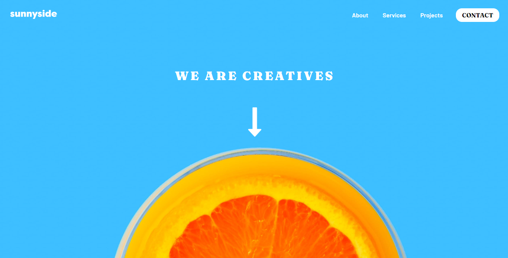

# Frontend Mentor - Sunnyside agency landing page solution

This is a solution to the [Sunnyside agency landing page challenge on Frontend Mentor](https://www.frontendmentor.io/challenges/sunnyside-agency-landing-page-7yVs3B6ef). Frontend Mentor challenges help you improve your coding skills by building realistic projects.

## Table of contents

- [Overview](#overview)
  - [The challenge](#the-challenge)
  - [Screenshot](#screenshot)
  - [Links](#links)
- [My process](#my-process)
  - [Built with](#built-with)
  - [What I learned](#what-i-learned)
- [Author](#author)

**Note: Delete this note and update the table of contents based on what sections you keep.**

## Overview

### The challenge

Users should be able to:

- View the optimal layout for the site depending on their device's screen size
- See hover states for all interactive elements on the page

### Screenshot

### Links

- Solution URL: [Frontend Mentor Solution](https://www.frontendmentor.io/solutions/responsive-landing-page-mobile-ipad-tablet-and-desktop-with-css-grid-Pd6HH0g3e)
- Live Site URL: [Sunny Website](https://alosoft.github.io/frontend_mentor-sunnyside-agency-landing-page-main/)

## My Process

### Built with

- Semantic HTML5 markup
- CSS custom properties
- BEM
- Flexbox
- CSS Grid
- Desktop-first workflow

### What I learned

This challenge was very interesting because most of the time I usually choose CSS Flexbox but I decide to complete the challenge with CSS Grid so that I can practice my CSS Grid skills on multiple devices screens

## Author

- Website - [Raymond Adutwum Agyei](https://corps-ai.herokuapp.com)
- Frontend Mentor - [@alosoft](https://www.frontendmentor.io/profile/alosoft)
- Linkedin - [Raymond Adutwum Agyei](https://www.linkedin.com/in/raymond-adutwum-agyei-366929117/)
